## Rossmann Store Sale - Previsão de Vendas Rossmann

Fonte:[Logo_Wik_Rossmann]https://logowik.com/rossmann-logo-vector-svg-pdf-ai-eps-cdr-free-download-14289.html

A Rossmann é uma grande e conhecida rede de farmácias alemã que opera mais de 3.000 drogarias em 7 países europeus, sendo uma das maiores. Dentre os itens comercializados estão os produtos de higiene, itens de conveniência, roupas, bebidas, etc. Possuem 36 marcas próprias que somam mais de 4200 produtos, além de empregar mais 52.000 funcionários. 
Apesar dos dados utilizados neste projeto serem de 2015, em 2019 ela atingiu volume de negócios superior a 10 mil milhões de euros na Alemanha , Polónia, Hungria, República Checa, Turquia, Albânia, Kosovo e Espanha. Segundo o Wikipedia, “Em 2021, as vendas aumentaram 8,1 por cento, para 11,1 mil milhões de euros. ”
## 1. Problema de Negócio
O Problema de negócio surgiu por solicitação que partiu do Chief Financial Officer (CFO) mediante a demanda de previsão de vendas das próximas 6 semanas para as 1.115 lojas alemãs. Como fonte de dados foi utilizado a base da competição Rossmann Store Sales no [Kaggle] (https://www.kaggle.com/c/rossmann-store-sales/). O nosso objetivo foi automatizar a previsão e tornar o modelo de Machine Learning padrão em todas as lojas, pois as previsões tinham como objetivo fornecer aos gerentes a capacidade de faturamento para avaliação de seguimento de projeto de reforma das lojas. 

No momento da solicitação do CFO, o time de Data Science foi acionado, uma vez que havia demora e inconsistências nos resultados entregues pelos gerentes. Isso se devia ao formato manual em que as previsões eram realizadas, sem considerar ou realizar as devidas análises sobre os fatores que influenciam nas previsões assertivas, incluindo promoções, concorrência, feriados escolares e estaduais, sazonalidade e localidade.

Ao final do projeto, entregamos previsões individualizadas por lojas que são requisitadas por um Bot no Telegram, garantindo maior assertividade e rapidez dos resultados.

## 2. Premissas de Negócio
A solução foi construída seguindo as premissas abaixo:

A consulta da previsão de vendas estará disponível 24/7 e será acessível via aplicativo do Telegram. O CFO digitará o código da loja e receberá como resposta o valor da previsão para as próximas 6 semanas.
A previsão considera apenas as lojas que tiveram vendas superiores a 0 nos dados disponíveis.
Os dias em que as lojas estiverem fechadas serão excluídos da previsão.
Lojas sem informações sobre competidores próximos terão a distância fixada em 200.000 metros.

### 2.1. Descrição dos Dados
| Atributo                          | Descrição                                                                                                                                             |
| :-------------------------------- | :---------------------------------------------------------------------------------------------------------------------------------------------------- |
| Store                             | Identificador único de cada loja                                                                                                                      |
| Date                              | Data em que ocorreu o evento de venda                                                                                                                 |
| DayOfWeek                         | Variável numérica que representa o dia da semana                                                                                                      |
| Sales                             | Valor de vendas do dia                                                                                                                                |
| Customers                         | Quantidade de clientes na loja no dia                                                                                                                 |
| Open                              | Indicador para loja aberta = 1 ou fechada = 0                                                                                                         |
| StateHoliday                      | Indica se o dia é feriado de estado. a = Feriado público, b = Feriado de páscoa, c = Natal, 0 = Não há feriado                                        |
| SchoolHoliday                     | Indica se a loja foi ou não fechada durante o feriado escolar                                                                                         |
| StoreType                         | Indica o modelo de lojas. Pode variar entre a, b, c, d                                                                                                |
| Assortment                        | Indica o nível de variedade de produtos: a = básico, b = extra, c = estendido                                                                         |
| CompetitionDistance               | Distância (em metros) para o competidor mais próximo                                                                                                  |
| CompetitionOpenSince [Month/Year] | Indica o ano e mês em que o competidor mais próximo abriu                                                                                             |
| Promo                             | Indica se a loja está com alguma promoção ativa no dia                                                                                                |
| Promo2                            | Indica se a loja deu continuidade na promoção: 0 = loja não está participando, 1 = loja participando                                                  |
| Promo2Since [Year/Week]           | Descreve o ano e semana de quando a loja começa a a promoção extendida                                                                                |
| PromoInterval                     | Descreve os meses em que a loja iniciou a promo2, ex.: "Feb,May,Aug,Nov" significa que a loja iniciou as promoções estendidas em cada um desses meses |

## 3. Estratégia da Solução
Para solução do problema de negócio adotamos uma estratégia cíclica amplamente conhecida na mineração de dados, o CRISP-DM (Cross Industry Standard Process for Data Mining). Com o objetivo de garantir agilidade e eficiência para a entrega, assim como agregar valor para a empresa, auxiliando assim o CFO a tomar decisões ágeis. 

O método permite que a cada ciclo seja possível o aprimoramento do modelo. Mas, o mais importante é a possibilidade de uma entrega minimamente utilizável e com isso ganhar tempo e já pode agregar algum valor ao negócio. Isso é possível, pois ele é composto por 9 etapas cíclicas, em que a cada iteração destas, há a possibilidade de melhorias quanto a qualidade e precisão.
### Passos do CRISP-DM:
1. **Problema de Negócio:** Esta etapa tem como objetivo receber o problema de negócio que será resolvido. É nesta etapa que é recebido a pergunta ou o pedido feito pelo dono do problema, que no caso deste projeto, é o CFO da rede Rossmann.

2. **Entendimento de Negócio:** Esta etapa tem como objetivo entender a dor do dono do problema e qual a sua real necessidade. Nesta etapa podem surgir protótipos da solução para validar com o dono do problema o que ele deseja como solução. 

3. **Coleta de Dados:** Esta etapa tem como objetivo realizar a coleta dos dados, buscando eles nas tabelas do(s) banco(s) de dados da empresa. 

4. **Limpeza dos Dados:** Esta etapa tem como objetivo remover toda e qualquer sujeira nos dados. Um dado sujo pode ser entendido como um dado que irá atrapalhar a performance final do algoritmo de Machine Learning. Tomando o cuidado entender bem o fenômeno que está sendo estudado para que não sejam removidos dados importantes para a modelagem do problema.

5. **Exploração dos Dados:** Esta etapa tem como objetivo entender os dados e como eles se relacionam entre si. Normalmente, são criadas hipóteses acionáveis de negócio que são posteriormente validadas utilizando técnicas de análise de dados. Além da criação de novas *features* que serão utilizadas na etapa de Modelagem de Dados.

6. **Modelagem dos Dados:** Esta etapa tem como objetivo preparar os dados para que eles sejam utilizados pelos algoritmos de Machine Learning. É nesta etapa que são feitos as transformações e *encodign* dos dados, a fim de facilitar o aprendizado do algoritmo utilizado.

7. **Aplicação de Algoritmos de Machine Learning:** Esta etapa tem como objetivo selecionar e aplicar algoritmos de Machine Learning nos dados preparados nas etapas anteriores. É nesta etapa que são selecionados os algoritmos é feita a comparação de performance entre eles, para selecionar o algoritmo que melhor performou como algoritmo final.

8. **Avaliação de Performance:** Esta etapa tem como objetivo verificar a performance do algoritmo selecionado na etapa anterior com os resultados atuais, ou *baseline* atual. Neste momento é feita a tradução da performance do algoritmo para performance de negócio. Ou seja, quanto a solução criada trará de retorno financeiro para a empresa. Caso a performance seja aceitável, o algoritmo é publicado e é retornado para a etapa de entendimento de negócio novamente, a fim de entender melhor possíveis lacunas e assim melhorar a performance do algoritmo selecionado. Caso a performance não seja aceitável, o algoritmo não é publicado e é retornado para a etapa de entendimento de negócio para fazer uma nova iteração e assim melhorar a performance da solução.

9. **Publicação da Solução:** Esta etapa tem como objetivo publicar o algoritmo selecionado, deixando público e utilizável a solução criada.

### 3.1. Produto Final
A solução combinada com o CFO foi por meio de um Bot no Telegram onde seria possível realizar a previsão de vendas das próximas seis semanas independente do local da solicitação. 

Após as solicitações serem realizadas via telegram, utilizamos a criação de uma API para o produto final, que permite que esta API retorna as previsões das lojas, através do uso de modelo de Machine Learning desenvolvido para este fim.
### 3.2. Ferramentas Utilizadas
Para criar a solução, foram utilizadas as seguintes ferramentas:
- Linguagem de Programação Python versão 3.8.5
- Versionador de código Git
- Aplicação Jupyter Notebook para prototipar a solução
- Serviço de Hospedagem em Nuvem
- Técnicas de manipulação de dados utilizando a linguagem de programação Python
- Técnicas de redução de dimensionalidade e seleção de atributos
- Algoritmos de Machine Learning da biblioteca [scikit-learn](https://scikit-learn.org/stable/) da linguagem de programação Python

## 4. Top 3 Insights
Foi criado um Mindmap para ajudar na construção de Hipóteses, a fim de facilitar e delimitar o escopo da etapa de análise exploratória.

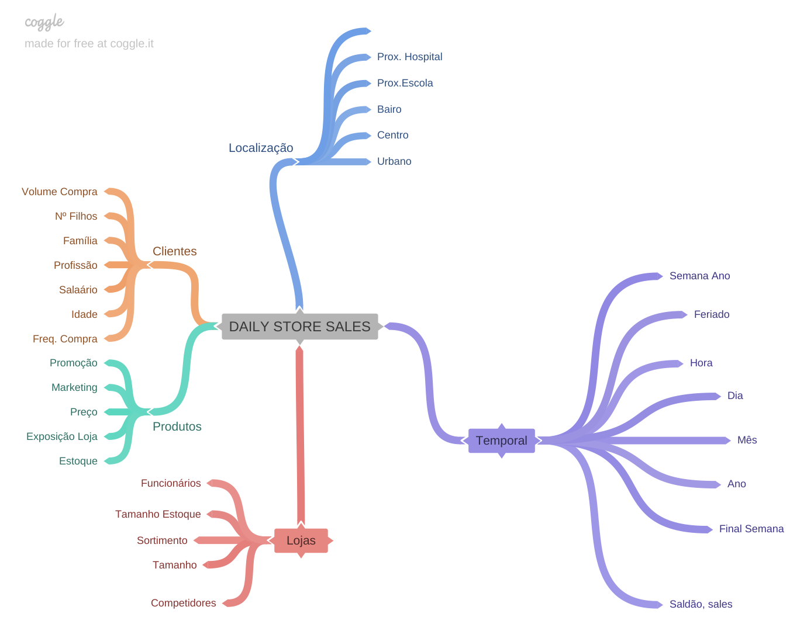

Através do Mindmap, foram geradas 17 hipóteses de negócio. Dessas, 12 foram selecionadas para validação, confirmando premissas da equipe de negócios e do responsável pelo problema. Além disso, foram gerados insights relevantes para ambos os grupos.

Dos 12 hipóteses verificadas, destacaram-se três principais insights.
### 4.1 Os 3 maiores Insights
## Insight 1: Lojas com mais sortimento deveriam vender mais.

**Hipótese Falsa:** Lojas com mais sortimento vendem menos

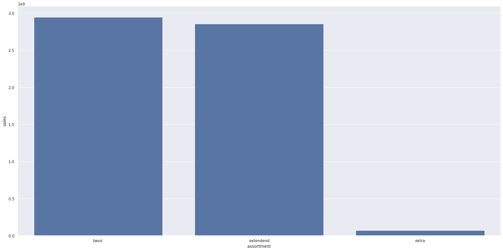
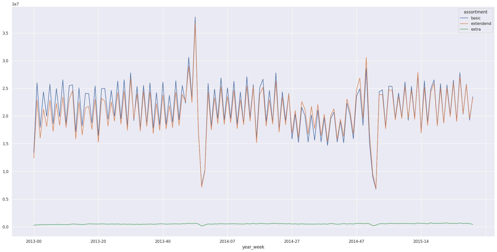
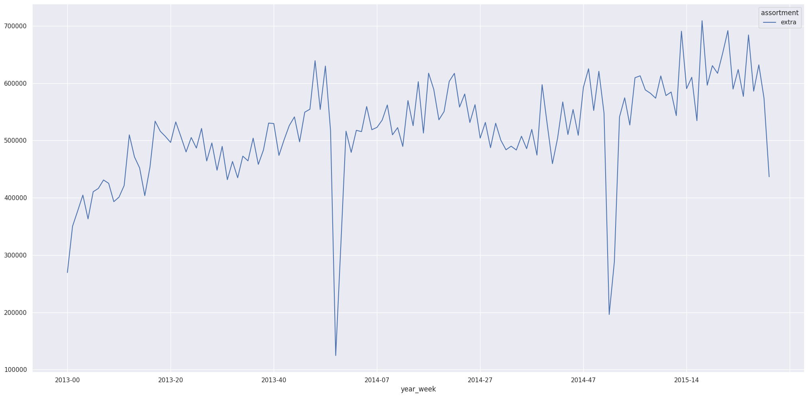

## Insight 2: Lojas deveriam vender mais no segundo semestre do ano.

**Hipótese Falsa:** Lojas vendem mais no primeiro semestre

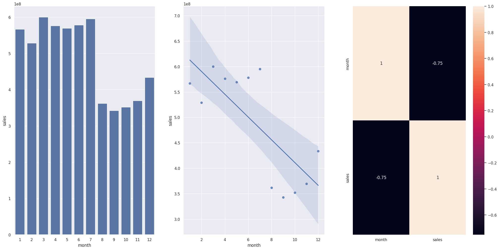

## Insight 3: Lojas deveriam vender mais depois do dia 10 de cada mês.

**Hipótese Verdadeira:** Lojas vendem menos até o dia 10

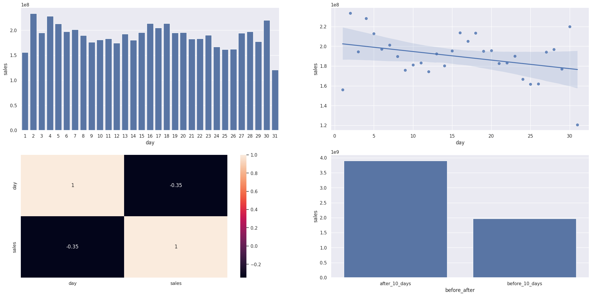

## 5. Modelos de Machine Learning
No primeiro ciclo do projeto, foram selecionados cinco algoritmos para teste, visando identificar o algoritmo com melhor desempenho e custo de implementação. Nessa etapa inicial, optou-se pela simplicidade, considerando que era o primeiro ciclo do projeto e o objetivo principal era entregar uma solução mínima utilizável para a equipe de negócios e polo CFO.

Os algoritmos selecionados foram:
- Avarege Model
- Linear Regression
- Linear Regression - Lasso
- Random Forest Regressor
- XGBRegressor

Após a seleção dos algoritmos, procedemos com o treinamento e teste de cada um deles para avaliar sua performance. Além disso, utilizamos o método de seleção de features * [Boruta](https://mbq.github.io/Boruta/) para identificar as variáveis mais relevantes e impactantes na base de dados. 

## 6. Seleção do Modelo de Machine Learning
### 6.1. Escolha da Métrica
Na escolha entre os algoritmos, utilizamos a métrica ***MAPE (Mean Absolute Percentage Error)***, que é uma medida de erro que expressa a porcentagem média do erro em relação ao valor real. Optamos por essa métrica porque ela é mais compreensível para a equipe de negócios e o CEO, uma vez que fornece uma representação percentual do erro em relação ao valor médio. Dessa forma, é mais fácil interpretar e comunicar o desempenho dos algoritmos selecionados.
### 6.2. Métricas dos Algoritmos 
Após os testes inicias, obtivemos os seguintes resultados:

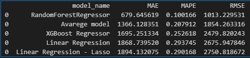 

### 6.3. Métricas dos Algoritmos - Time Series Cross-Validation
Após testar os algoritmos selecionados, utilizamos a técnica de ***Cross Validation*** para validar os resultados e garantir a real performance de cada modelo utilizado. No nosso caso, como estávamos lidando com uma série temporal, aplicamos uma forma específica de ***Cross Validation*** que leva em consideração a ordem cronológica dos dados durante o treinamento dos algoritmos. Significa que respeitamos a sequência temporal em que os dados foram coletados ou registrados. Isso é importante quando estamos trabalhando com séries temporais, onde a ordem dos eventos é relevante. Essa abordagem nos permite obter uma avaliação mais precisa do desempenho dos modelos ao longo do tempo.

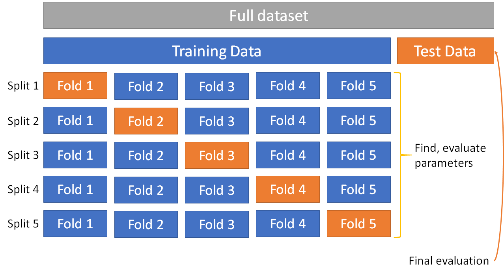

Com esse método de validação, foram obtidas as seguintes performances:

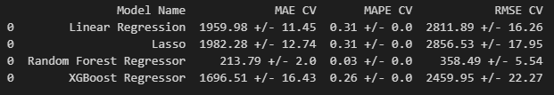 

### 6.5. Escolha do Modelo
Embora o algoritmo ***Random Fores Regressor*** tenha sido o algoritmo que melhor performou, o escolhifo foi o algoritmo ***XGBosst Regressor*** nesta etapa. 

- Primeiro porque o tempo de treinamento do ***XGBoost Regressor*** é mais rápido se comparado ao algoritmo ***Random Fores Regressor***. 
- Segundo porque o modelo final treinado pelo algoritmo ***XGBoost Regressor*** ocupa menos espaço que o algoritmo ***Random Fores Regressor***, deixando assim o uso de servidores em nuvem mais baratos.

### 6.5. Ajuste de Hiperparâmetros
Foi utilizada a técnica de Random Search para fazer a busca dos melhores hiperparâmetros. Segue os parâmetros que melhor performaram e model final tuned (XGBoost).

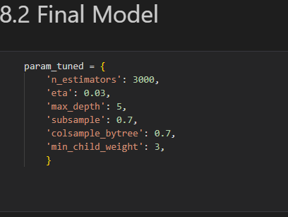

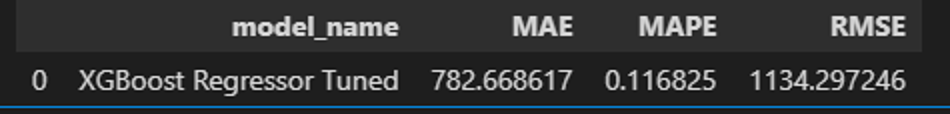

### 6.6 Performance do modelo
Como podemos observar nos dois primeiros gráficos abaixo, o modelo selecionado obteve uma performance aceitável, visto que conseguiu entender e reproduzir o padrão de vendas ao longo dos anos estudados.
Já nos dois últimos gráficos, podemos observar uma distribuição normal a cerca das previsões, o que nos indica um bom resultado do modelo selecionado, além de podermos verificar a distribuição dos erros do modelo.

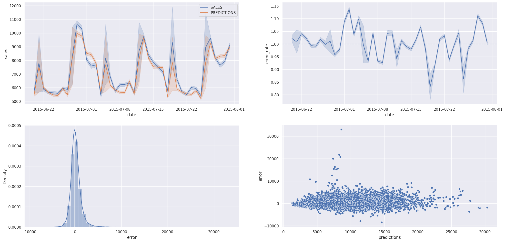

## 7. Resultado de Negócio
Com o modelo selecionado e treinado, obtivemos a seguinte performance de negócio para as 5 melhores lojas:

(image em confecção)

<!-- 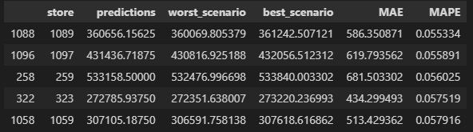  -->

Como resultado final, temos os seguintes cenários:

<!-- 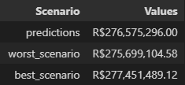 -->

| Cenários       |           Valores |
| :------------- | ----------------: |
| Previsão Feita | \$ 276,575,296.00 |
| Pior Cenário   | \$ 275,699,104.58 |
| Melhor Cenário | \$ 277,451,489.12 |

### 7.1. Distribuição das Previsões por Loja
Como podemos ver na distribuição de performance abaixo existem alguns outliers indicados pelo alto MAE, prejudicando assim a previsão de algumas lojas. Portanto, em uma próxima iteração do ciclo crisp-dm podem ser analisadas individualmente a fim de analisar quais os problemas que estas lojas apresentam.

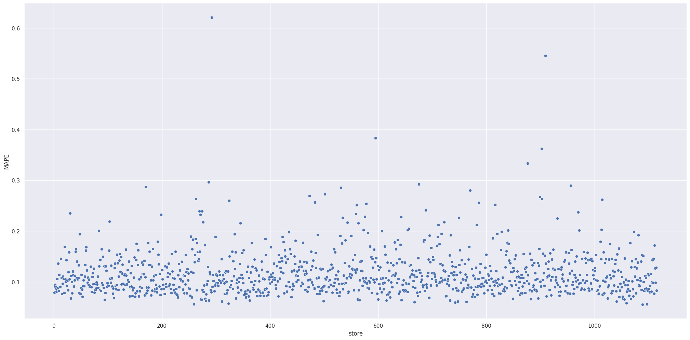 

## 8 Aplicação
Este gif demonstra uma simulação do CFO solicitando previsões de algumas lojas com base no modelo final apresentado como solução. 

<!--  -->

<video width="320" height="240" controls>
  <source src="img/application.mp4" type="video/mp4">
  Seu navegador não suporta o elemento de vídeo.
</video>

## 9. Conclusões
De acordo com o exposto até aqui, o projeto conseguiu atender a demanda do CFO, permitindo previsões padronizadas, automatizadas e acessíveis a qualquer momento.

Com o BOT criado para solicitar previsões há uma maior rapidez quanto às tomadas de decisões oriundas destas previsões de vendas.

## 10. Lições Aprendidas
* Priorizar tarefas e soluções;

* Desenvolver soluções de forma cíclica, entregando assim resultado mais rapidamente;

* Construção de um BOT para o aplicativo de mensagens Telegram, afim de agilizar o acesso à informações.

## 11. Próximos Passos
* Realizar uma investigação detalhada para identificar as causas das previsões inadequadas em algumas lojas.

* Explorar a inclusão de diferentes algoritmos durante a próxima fase de treinamento, com o objetivo de aprimorar a precisão das previsões.

* Desenvolver uma aplicação web usando o framework Streamlit, permitindo que os gerentes das lojas acessem e visualizem as previsões de forma fácil e intuitiva.

* Implementar testes unitários abrangentes para validar a funcionalidade das classes e funções desenvolvidas.

* Identificar e criar novas variáveis (features) que possam contribuir para melhorar o desempenho do modelo atual e futuros modelos de previsão.

* Aplicar técnicas avançadas de programação para otimizar a eficiência e o desempenho da solução.

